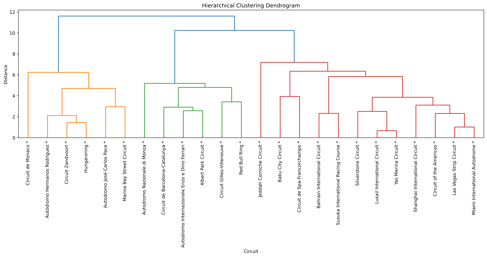
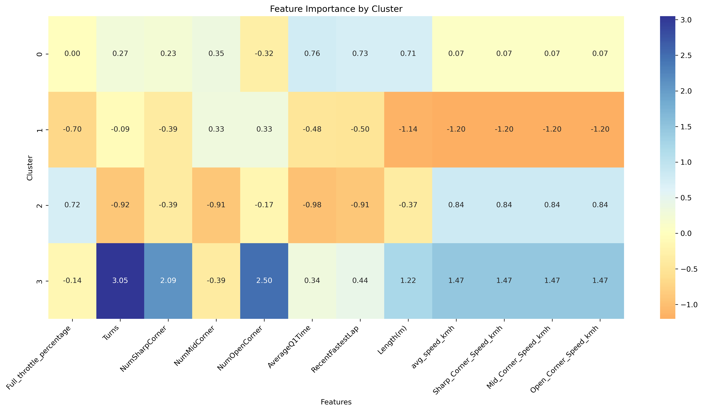
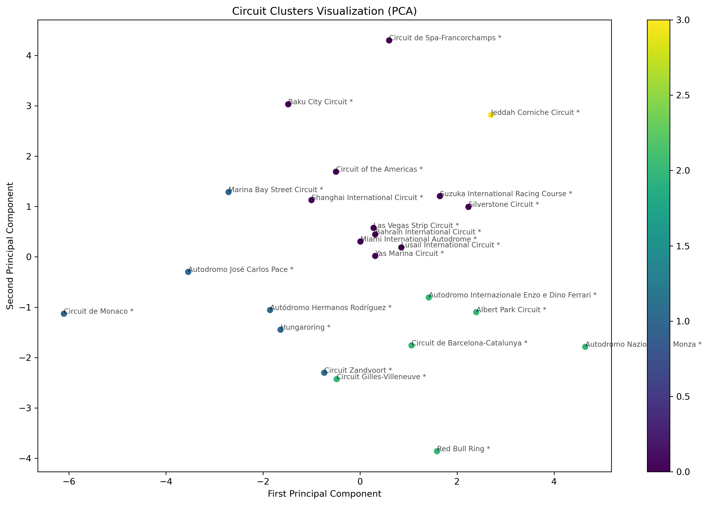

# F1 Circuits Hierarchical Clustering Analysis

This project performs hierarchical clustering analysis on Formula 1 circuits based on their physical characteristics and performance metrics. The analysis groups similar circuits together to identify patterns and relationships between different tracks.

## Overview

The analysis clusters F1 circuits using the following features:
- Full throttle percentage
- Number of turns (Sharp, Mid, Open corners)
- Average speed
- Circuit length
- Circuit type (Race circuit vs Street circuit)

## Clustering Results Visualization

### Hierarchical Clustering Dendrogram

The dendrogram shows the hierarchical relationship between circuits, with the vertical axis representing the distance or dissimilarity between clusters. The colors indicate different main clusters identified in the analysis.

### Feature Importance Heatmap

The heatmap displays the relative importance of different features for each cluster, with darker blue indicating higher values and darker orange indicating lower values. This visualization helps understand what characteristics define each cluster.

### PCA Visualization

The PCA plot shows the circuits projected onto two dimensions, with colors indicating cluster membership. This visualization helps understand the spatial relationships between circuits and clusters.

## Detailed Cluster Analysis

### Cluster 0 (High-Speed Modern Circuits)
- **Number of circuits:** 10
- **Notable circuits:** Circuit of the Americas, Las Vegas Strip, Miami, Spa-Francorchamps
- **Key characteristics:**
  - Average speed: 228 km/h
  - Full throttle: 61%
  - Corner distribution: 9 sharp, 5 mid, 5 open
  - Average length: 5.83 km
- **Circuit types:** 6 race circuits, 4 street circuits
- **Distinguishing features:** Modern layouts with balanced mix of corners and good overtaking opportunities

### Cluster 1 (Speed-Focused Circuits)
- **Number of circuits:** 4
- **Circuits:** Monza, Albert Park, Gilles-Villeneuve, Red Bull Ring
- **Key characteristics:**
  - Highest average speed: 243 km/h
  - Highest full throttle: 68%
  - Fewer corners: 6 sharp, 2 mid, 5 open
  - Shortest average length: 4.94 km
- **Circuit types:** 2 race circuits, 2 street circuits
- **Distinguishing features:** Focus on straight-line speed and minimal technical sections

### Cluster 2 (Technical Circuits)
- **Number of circuits:** 6
- **Notable circuits:** Monaco, Hungaroring, Marina Bay
- **Key characteristics:**
  - Lowest average speed: 198 km/h
  - Lowest full throttle: 55%
  - Balanced corners: 8 sharp, 4 mid, 5 open
  - Shortest circuits: 4.26 km average
- **Circuit types:** 4 race circuits, 2 street circuits
- **Distinguishing features:** Technical layouts emphasizing driver skill over straight-line speed

### Cluster 3 (Traditional Race Circuits)
- **Number of circuits:** 4
- **Circuits:** Imola, Bahrain, Barcelona, Suzuka
- **Key characteristics:**
  - High average speed: 232 km/h
  - Good full throttle: 65%
  - Most sharp corners: 13 sharp, 3 mid, 1 open
  - Medium length: 5.20 km
- **Circuit types:** All race circuits (4)
- **Distinguishing features:** Classic layouts with emphasis on technical corners while maintaining good speed

## Code Structure

### Main Functions

1. `plot_dendrogram(X_scaled, df, max_d=None)`
   - Generates hierarchical clustering dendrogram
   - Helps visualize the clustering hierarchy
   - Optional cutoff line for cluster determination

2. `calculate_cophenetic_correlation(X_scaled, linkage_matrix)`
   - Evaluates clustering quality
   - Returns correlation coefficient between original and cophenetic distances

3. `perform_hierarchical_clustering(X_scaled, n_clusters)`
   - Executes the hierarchical clustering algorithm
   - Returns cluster labels for each circuit

4. `visualize_clusters_pca(X_scaled, df_clustered)`
   - Creates PCA visualization of clusters
   - Projects high-dimensional data onto 2D space
   - Includes circuit labels and color coding

5. `create_feature_importance_plot(X_scaled, numerical_columns, cluster_labels)`
   - Generates heatmap of feature importance by cluster
   - Helps interpret cluster characteristics

6. `analyze_clusters(df_clustered)`
   - Provides detailed statistical analysis of each cluster
   - Includes means, standard deviations, and circuit types

## Dependencies

- NumPy
- Pandas
- Matplotlib
- Seaborn
- Scikit-learn

## Notes

- The analysis uses Ward's method for hierarchical clustering
- Features are scaled before clustering to ensure equal weighting
- PCA is used for visualization purposes only, clustering is performed on the full feature set

## Future Improvements

1. Include additional circuit characteristics:
   - Elevation changes
   - Weather conditions
   - Track surface analysis
2. Incorporate race performance statistics:
   - Overtaking opportunities
   - DRS zones impact
   - Tire degradation patterns
3. Add interactive visualizations
4. Include historical track changes analysis

## Contributing

Feel free to fork this repository and submit pull requests with improvements or additional analyses.
